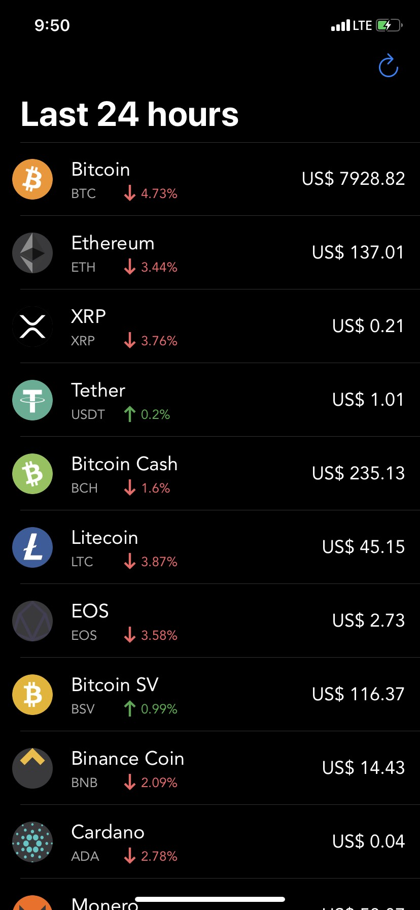
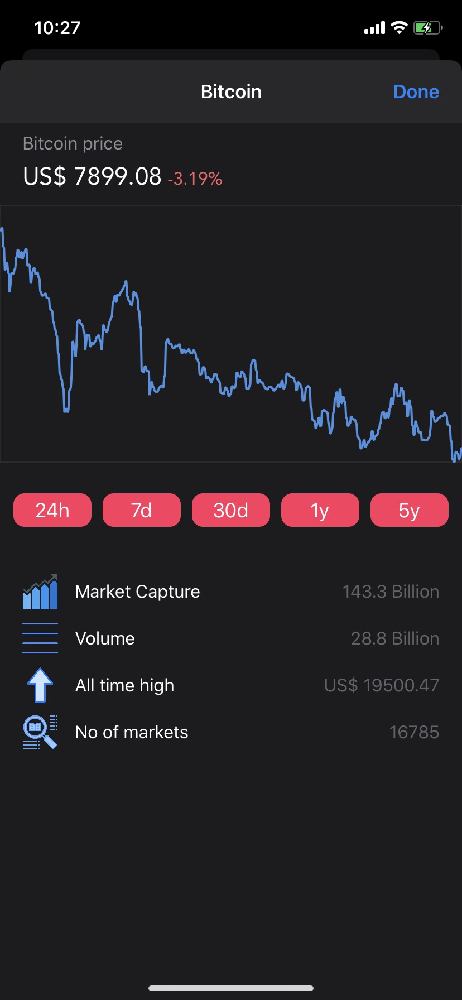
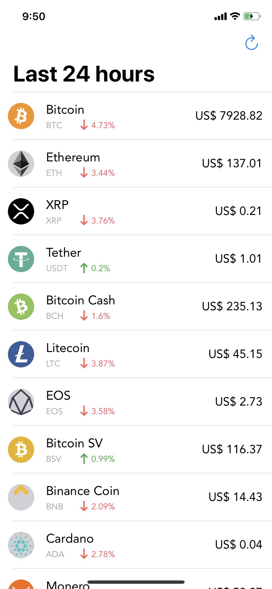
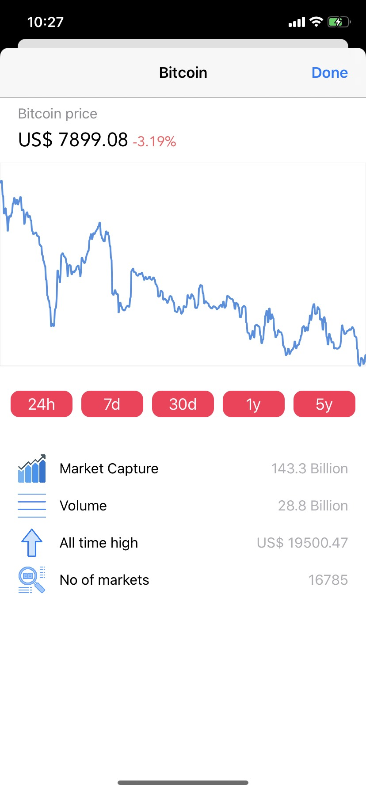

# Reminder

The app utilises CoinRanking API and shows users the details about cryptocurrencies in the market.

## App Features

1. Get price info about the most trending cryptocurrencies in the market.
2. Shows the cryptocurrency's price history in the form of a line chart.
3. Adapts to dark or light mode based on the system.

## Implementation

The app contains 2 View Controllers :
1. CoinListViewController - It shows the list of most trending cryptocurrencies in the market.
2. DetailViewController - It shows the details about a particular cryptocurrency and price history in the form of a line chart.

## How to build/compile
1. Open "CryptoBuzz.xcworkspace" file.
2. Select appropriate simulator.
3. Click the run button or command + R to run the project.

## Requirements
1. Xcode 11
2. Swift 5
3. iOS 13

## API used
https://coinranking.com/page/cryptocurrency-api

## Screenshots
  &nbsp; &nbsp;  &nbsp; &nbsp;  &nbsp; &nbsp; 

## License
This code is free and open source.
